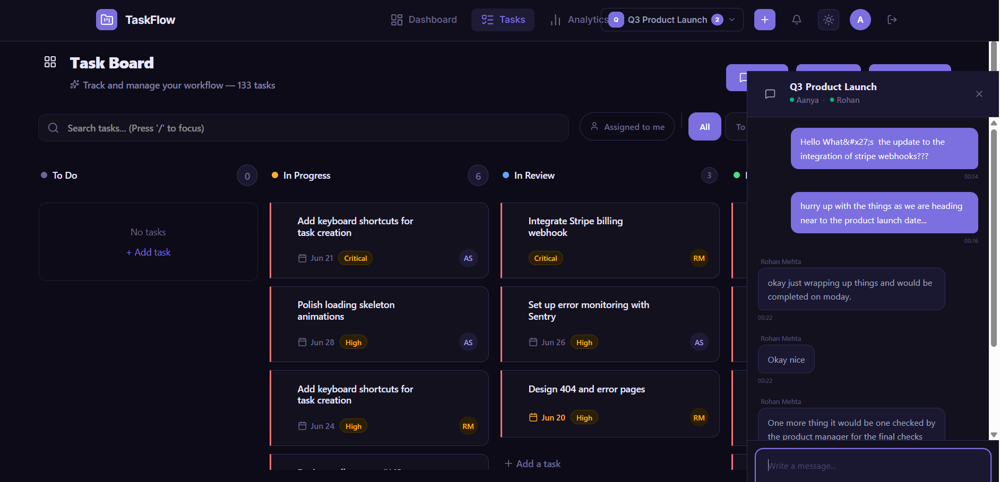
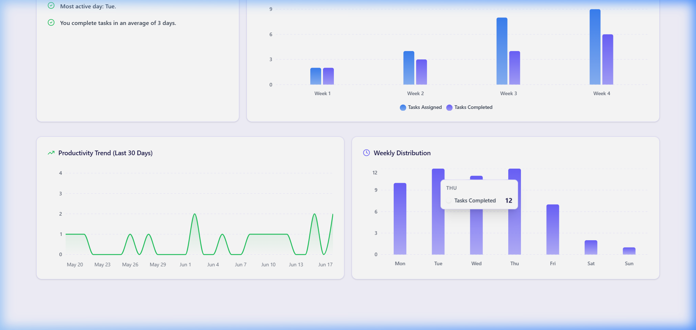
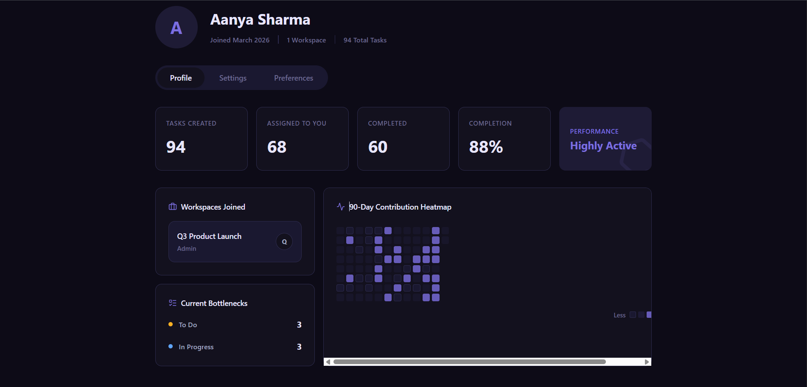

<h1 align="center">📋 TaskFlow</h1>
<p align="center">
  A full-stack task management platform with real-time collaboration, multi-workspace support, and role-based access control.
</p>

<p align="center">
  
  
  
  
  
  
</p>

---

## 🌐 Live Demo

| | Link |
|---|---|
| 🖥 **Frontend** | [task-flow-omega-khaki.vercel.app](https://task-flow-omega-khaki.vercel.app) |
| 🔗 **Backend API** | [taskflow-2o2c.onrender.com/api/health](https://taskflow-2o2c.onrender.com/api/health) |
| 📑 **Swagger Docs** | [taskflow-2o2c.onrender.com/api-docs](https://taskflow-2o2c.onrender.com/api-docs) |

> ⚡ **Note:** Backend is on Render's free tier — first request after inactivity may take ~30 seconds to cold-start.

> 🔑 **Try it live:** Log in with `aanya.demo@taskflow.local` / `Demo@1234` on the [live demo](https://task-flow-omega-khaki.vercel.app), or register your own free account. (Note: this is a shared demo account — data may change as other visitors interact with it.)

Want a clean, private dataset instead? Run `npm run seed` locally (see `backend/scripts/seedDemoData.js`) to generate your own realistic 90-day workspace.*

---

## 📸 Screenshots

<table>
<tr>
<td align="center" width="50%"><br/><sub><b>Kanban board with live drag-and-drop</b></sub></td>
<td align="center" width="50%"><br/><sub><b>Real-time chat with typing indicators</b></sub></td>
</tr>
<tr>
<td align="center" width="50%"><br/><sub><b>Productivity trend & weekly distribution</b></sub></td>
<td align="center" width="50%"><br/><sub><b>90-day contribution heatmap</b></sub></td>
</tr>
</table>

---

## ✨ Key Features

| Category | What it actually does |
|---|---|
| **Multi-Workspace** | Users can create, switch between, and manage multiple workspaces. Each workspace has full data isolation. On register, a default "My Workspace" is auto-created. |
| **Kanban Board** | Four-column board (Todo → In Progress → In Review → Done). Cards are draggable between columns using @dnd-kit; status updates are persisted to the backend and broadcast via Socket.IO. |
| **Task Management** | Create, update, assign, and delete tasks. Each task has title, description, status, complexity (Easy/Medium/Hard), due date, and an assignee. An automated nightly cron job recalculates priority scores based on due date proximity and active task count. |
| **Task Activity Log** | Every create, update, and delete action on a task is recorded in a `TaskActivity` collection and viewable as a per-task audit trail. |
| **RBAC** | Two roles per workspace: `admin` and `member`. Admins can invite members, change roles, delete any task, delete/restore the workspace, and transfer ownership. Members can create tasks and delete only their own tasks. Enforced in `workspaceAuth.js` middleware. |
| **Invite System** | Admins send email-based invites via the dashboard. Recipients can accept or reject from their pending invites list. The invite flow uses a dedicated `Invite` model, not just direct member injection. |
| **Real-Time Chat** | Per-workspace chat panel with typing indicators, read receipts (seenBy), and unread message badges on workspace tabs. Messages are persisted to MongoDB and broadcast over Socket.IO. |
| **Presence Tracking** | Online/offline state is tracked server-side via a `Map` of `socketId → userId`. When a user disconnects from their last tab, a `userOffline` event is broadcast. |
| **Analytics Dashboard** | Workspace-scoped stats (total/todo/in-progress/done counts), last-7-days productivity chart (created vs. completed per day), and recent activity feed. Results cached server-side for 5 minutes via `node-cache`. |
| **User Analytics** | Per-user performance metrics: completion rate, avg completion time (days), contribution (tasks created/delegated), 30-day productivity trend, weekly distribution by day, and a 4-week completion rate trend. All scoped to a specific workspace. |
| **Profile Heatmap** | 90-day contribution heatmap on the profile page, showing daily task completion activity. Data comes from `/api/v1/profile/:userId/activity`. |
| **Soft Delete for Workspaces** | Deleting a workspace sets `isDeleted: true` and records `deletedAt`. A separate restore endpoint (`POST /:id/restore`) flips it back. Only the workspace owner can delete or restore. |
| **Swagger Docs** | Full interactive API documentation served at `/api-docs`, auto-generated from code via `swagger-jsdoc`. |

---

## 🛠 Tech Stack

### Backend

| Technology | Purpose |
|---|---|
| **Node.js + Express** | HTTP server and REST API routing |
| **MongoDB + Mongoose** | Document database with typed schemas and compound indexes |
| **Socket.IO** | Real-time bidirectional events (chat, presence, task updates). Falls back to long-polling if WebSockets aren't available. |
| **JWT + bcrypt** | Stateless auth with access/refresh token rotation. Passwords hashed with bcrypt (salt rounds: 12). |
| **Zod** | Request body validation. All auth, workspace, task, chat, and invite routes parse request bodies against Zod schemas before hitting controllers. |
| **Helmet** | Configures security headers (CSP, HSTS, X-Frame-Options, noSniff, etc.) |
| **Morgan + Winston** | HTTP request logging piped into structured Winston JSON logs |
| **express-rate-limit** | 100 req/15 min globally; stricter 20 req/15 min on auth routes |
| **express-mongo-sanitize + hpp** | Strips `$` operator injections from input; prevents HTTP parameter pollution |
| **node-cache** | In-memory cache for analytics queries (5-minute TTL) |
| **node-cron** | Nightly job (midnight) that recalculates task priority scores for overdue/active tasks |
| **Swagger** | Interactive API docs at `/api-docs` |

### Frontend

| Technology | Purpose |
|---|---|
| **React 19** | UI framework |
| **React Context API** | Global state for auth, active workspace, and socket connection |
| **Tailwind CSS v4** | Utility-first styling with a custom CSS variable-based theme for light/dark mode |
| **@dnd-kit** | Drag-and-drop for the Kanban board (`DndContext`, `useSortable`, `useDroppable`) |
| **Recharts** | Charts on the Dashboard (area chart) and Analytics page (bar, line, radial) |
| **Socket.IO-client** | Connects to the backend Socket.IO server for real-time events |
| **react-hot-toast** | Toast notifications for actions and errors |
| **react-router-dom v7** | Client-side routing |

---

## 🏗 Architecture

```
┌──────────────┐    HTTPS / WebSockets    ┌──────────────────┐       Mongoose      ┌──────────────┐
│              │  ────────────────────▶   │                  │  ──────────────▶    │              │
│    React     │    /api/v1/*   [WS]      │   Node.js API    │     Queries         │   MongoDB    │
│    Client    │  ◀────────────────────   │   (Socket.IO)    │  ◀──────────────    │   Database   │
│              │      JSON + JWT          │                  │     Documents       │              │
└──────────────┘                          └──────────────────┘                     └──────────────┘
```

**Key design decisions:**
- **Service layer pattern** — Controllers are thin; all business logic lives in `services/`. This makes it straightforward to test or swap data sources independently.
- **Workspace-first indexing** — All compound indexes on `Task` lead with `workspace` field so multi-tenant queries use the index efficiently. Actual indexes defined in `Task.js`:
  ```js
  taskSchema.index({ workspace: 1, status: 1 });
  taskSchema.index({ workspace: 1, createdBy: 1 });
  taskSchema.index({ workspace: 1, assignedTo: 1, status: 1, updatedAt: -1 });
  taskSchema.index({ workspace: 1, updatedAt: -1 });
  ```
- **Soft delete for workspaces** — `isDeleted: true` + `deletedAt` timestamp. A restore endpoint exists. There is **no time-gated permanent deletion** — the restore window is indefinite until Vishal decides to implement a cleanup cron.
- **Hard delete for tasks** — `task.deleteOne()` is called directly. Task deletion is permanent, but an activity record is written to `TaskActivity` before deletion so the history is preserved.
- **JWT with refresh token rotation** — Access tokens expire based on `JWT_EXPIRES_IN` (default: 7d). Refresh tokens are stored in the User document and rotated on each use.
- **Graceful shutdown** — `SIGTERM`/`SIGINT` handlers drain connections with a 10-second force-exit timeout.

---

## 📡 API Reference

All routes are prefixed `/api/v1` and require `Authorization: Bearer <token>` unless noted. *(See [Swagger docs](https://taskflow-2o2c.onrender.com/api-docs) for full request/response schemas.)*

### System (no auth required)
| Method | Endpoint | Description |
|---|---|---|
| `GET` | `/api/health` | Health check — returns server status, environment, timestamp |
| `GET` | `/api-docs` | Swagger UI |
| `GET` | `/api-docs.json` | Raw OpenAPI JSON spec |

### Authentication (rate-limited: 20 req/15 min)
| Method | Endpoint | Description |
|---|---|---|
| `POST` | `/api/v1/auth/register` | Register a new user; auto-creates a default workspace |
| `POST` | `/api/v1/auth/login` | Authenticate; returns access + refresh tokens |
| `POST` | `/api/v1/auth/refresh-token` | Exchange a valid refresh token for a new token pair |

### Workspaces
| Method | Endpoint | RBAC | Description |
|---|---|---|---|
| `POST` | `/api/v1/workspaces/create` | Any member | Create a new workspace |
| `GET` | `/api/v1/workspaces` | Any member | List all workspaces for the authenticated user |
| `GET` | `/api/v1/workspaces/summaries` | Any member | List workspaces with last message + unread count (used in sidebar) |
| `PATCH` | `/api/v1/workspaces/:id` | Admin only | Update workspace name/description |
| `DELETE` | `/api/v1/workspaces/:id` | Owner only | Soft-delete the workspace (`isDeleted: true`) |
| `POST` | `/api/v1/workspaces/:id/restore` | Owner only | Restore a soft-deleted workspace |
| `POST` | `/api/v1/workspaces/:id/leave` | Any member | Leave a workspace (blocked if you're the last admin) |
| `POST` | `/api/v1/workspaces/:id/rejoin` | Any user | Re-join a workspace you previously left |
| `POST` | `/api/v1/workspaces/:id/transfer-ownership` | Owner only | Transfer ownership to another existing member |
| `POST` | `/api/v1/workspaces/invite` | Admin only | Add a user to workspace by email (legacy direct-add) |
| `GET` | `/api/v1/workspaces/:id/members` | Any member | List workspace members with roles |
| `PATCH` | `/api/v1/workspaces/role` | Admin only | Change a member's role (`admin` ↔ `member`) |

### Tasks
| Method | Endpoint | RBAC | Description |
|---|---|---|---|
| `POST` | `/api/v1/tasks` | Any workspace member | Create a task (validates assignee is in workspace) |
| `GET` | `/api/v1/tasks/workspace/:workspaceId` | Any workspace member | Paginated, filterable task list for a workspace |
| `GET` | `/api/v1/tasks/:id` | Any workspace member | Get full task details |
| `PUT` | `/api/v1/tasks/:id` | Any workspace member | Update task fields; recalculates priority if due date/complexity changes |
| `DELETE` | `/api/v1/tasks/:id` | Admin or task creator | Hard-delete a task (activity record preserved) |
| `PATCH` | `/api/v1/tasks/assign` | Any workspace member | Assign a task to a workspace member |
| `GET` | `/api/v1/tasks/:id/activity` | Any workspace member | Get the full activity log for a task |

### Boards & Lists
| Method | Endpoint | Description |
|---|---|---|
| `POST` | `/api/v1/boards` | Create a board in a workspace |
| `GET` | `/api/v1/boards/:workspaceId` | Get all boards for a workspace |
| `POST` | `/api/v1/lists` | Create a list/column inside a board |
| `GET` | `/api/v1/lists/:boardId` | Get all lists for a board |

### Invites
| Method | Endpoint | RBAC | Description |
|---|---|---|---|
| `POST` | `/api/v1/invites/send` | Admin only | Send an invite to a user by email |
| `GET` | `/api/v1/invites/pending` | Any user | Get pending invites for the logged-in user |
| `POST` | `/api/v1/invites/accept` | Invite recipient | Accept a pending invite |
| `POST` | `/api/v1/invites/reject` | Invite recipient | Reject a pending invite |

### Chat
| Method | Endpoint | Description |
|---|---|---|
| `POST` | `/api/v1/chat/send` | Send a chat message to a workspace |
| `GET` | `/api/v1/chat/:workspaceId` | Fetch message history for a workspace |
| `PATCH` | `/api/v1/chat/seen` | Mark messages as seen |

### Analytics & Profile
| Method | Endpoint | Description |
|---|---|---|
| `GET` | `/api/v1/analytics/dashboard?workspaceId=` | Workspace task stats, 7-day productivity, recent activity feed |
| `GET` | `/api/v1/analytics/user/:userId?workspaceId=` | Per-user performance, completion rate, productivity trend, weekly distribution |
| `GET` | `/api/v1/profile/:userId/activity` | 90-day activity heatmap for a user's profile page |

### Socket.IO Events (real-time)
| Direction | Event | Description |
|---|---|---|
| Client → Server | `joinUserRoom` | Joins a personal room (`user_<id>`) for targeted events; broadcasts presence |
| Client → Server | `joinWorkspace` | Joins a workspace room (`workspace_<id>`) for chat and task updates |
| Client → Server | `leaveWorkspace` | Leaves a workspace room |
| Client → Server | `send_message` | Persists and broadcasts a chat message to the workspace room |
| Client → Server | `typing` | Broadcasts "user is typing" to others in the workspace |
| Client → Server | `stop_typing` | Broadcasts "user stopped typing" |
| Client → Server | `message_seen` | Marks a message as seen and broadcasts the update |
| Server → Client | `new_message` | New chat message for a workspace |
| Server → Client | `user_typing` / `user_stop_typing` | Typing indicator state |
| Server → Client | `userOnline` / `userOffline` | Presence updates |
| Server → Client | `onlineUsers` | Initial list of online users on connect |
| Server → Client | `taskCreated` / `taskUpdated` / `taskMoved` / `taskDeleted` | Live Kanban board updates |
| Server → Client | `task_assigned` | Notifies relevant clients of a task assignment |
| Server → Client | `unread_message_increment` | Increments unread badge on a workspace tab |

---

## 🚀 Local Setup

### Prerequisites
- Node.js 18+
- MongoDB (local instance or [MongoDB Atlas](https://www.mongodb.com/atlas))

### Steps

**1. Clone the repo**
```bash
git clone https://github.com/rai0vishal/TaskFlow.git
cd TaskFlow
```

**2. Set up the backend**
```bash
cd backend
npm install
cp .env.example .env
# Fill in .env values (see table below)
npm run dev     # Starts on http://localhost:5000
```

**3. Set up the frontend** *(new terminal)*
```bash
cd frontend
npm install
npm run dev     # Starts on http://localhost:5173 (Vite default)
```

> **Note:** The frontend Vite dev server runs on **port 5173**, not 3000. The backend runs on **port 5000** (configured via `.env`). The old README's claim of "localhost:3000" for the frontend referred to a previous CRA setup.

### Backend Environment Variables

| Variable | Required | Description |
|---|---|---|
| `NODE_ENV` | Yes | `development` or `production` |
| `PORT` | Yes | Backend port (default: `5000`) |
| `MONGODB_URI` | Yes | MongoDB connection string |
| `JWT_SECRET` | Yes | Secret for signing access tokens (min 32 chars) |
| `JWT_REFRESH_SECRET` | Yes | Secret for signing refresh tokens (separate from `JWT_SECRET`) |
| `JWT_EXPIRES_IN` | Yes | Access token TTL (e.g. `7d`) |
| `CORS_ORIGIN` | Yes | Comma-separated allowed origins (e.g. `http://localhost:5173`) |
| `LOG_LEVEL` | No | Winston log level (`debug`, `info`, `warn`, `error`) |

---

## ⚠️ Known Limitations & Roadmap

### What's not there yet (stated plainly)
- **No automated tests** — there are no test files in this project. The `package.json` test script is a placeholder. This is the most significant gap before this project would be comfortable in a production handoff.
- **No CI/CD pipeline** — there is no `.github/workflows/` directory. Deployments to Render and Vercel are manual.
- **No time-gated hard deletion of soft-deleted workspaces** — workspaces flagged `isDeleted: true` stay in the database indefinitely. There's no cron job that permanently purges them after a window.
- **No email notifications** — invites are stored in the database and surfaced in-app, but no emails are sent.
- **No file attachments on tasks or chat.**
- **No demo seed script** — there are no demo credentials; users must register.

### Planned / In Progress
- [ ] Unit and integration tests (Jest + Supertest)
- [ ] CI/CD pipeline with GitHub Actions
- [ ] Time-gated permanent deletion of soft-deleted workspaces
- [ ] Email notifications for invites and task due dates
- [ ] Demo seed script with pre-populated data
- [ ] Task comments/thread
- [x] Refresh token rotation
- [x] Real-time task updates via Socket.IO
- [x] Workspace chat with typing indicators and read receipts
- [x] Analytics dashboard with charts
- [x] 90-day contribution heatmap on profile
- [x] Swagger API documentation

---

## 👤 Author

**Vishal Rai**
Full Stack / Backend Developer · [GitHub](https://github.com/rai0vishal)

---

<p align="center">Built with ❤️ — feedback and PRs welcome.</p>
